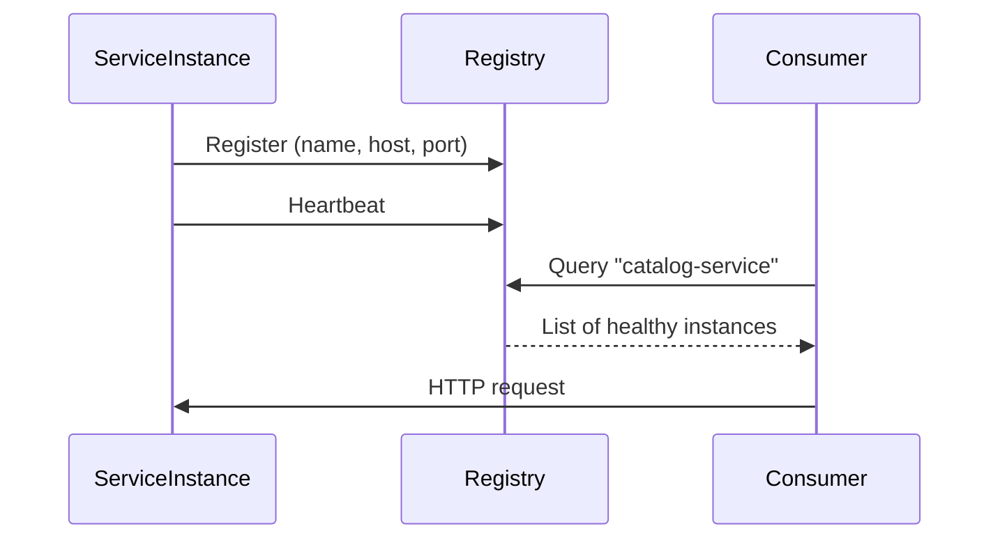
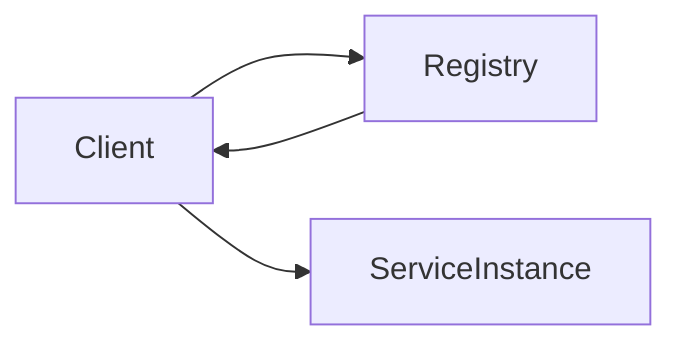
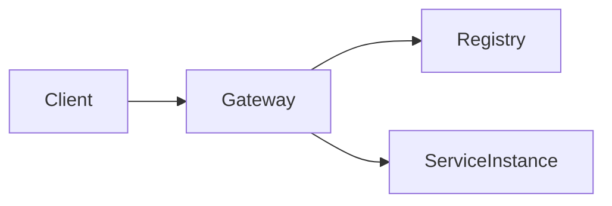

## Context and Purpose

In a microservices architecture, service instances are inherently dynamic. Containers are created and destroyed, pods are rescheduled, virtual machines are replaced, and autoscaling continuously adjusts capacity based on demand. As a result, IP addresses and ports cannot be treated as stable identifiers.

In a monolithic system, components communicate through in-memory calls and the deployment unit is fixed. In distributed systems, however, services communicate over the network, and that network layer introduces variability. If a service depends on hardcoded endpoints or static configuration files, every deployment, scaling event, or failure may require manual reconfiguration. This quickly becomes unmanageable.

**Service Discovery** exists to solve this problem. It allows services and clients to communicate using logical service names rather than physical network locations. The infrastructure dynamically resolves those names to healthy, running instances at runtime.

In practical terms, Service Discovery decouples *who* a service is from *where* it is running.

---

## Definition and Conceptual Overview

Service Discovery is a mechanism that enables dynamic resolution of service instances in distributed systems. Instead of calling `http://10.0.12.45:8080`, a consumer calls something like `http://catalog-service`, and the platform determines which instance should handle the request.

At its core, Service Discovery revolves around two essential capabilities:

* **Registration**: service instances announce their presence.
* **Resolution**: consumers retrieve available instances and route requests accordingly.

Behind these capabilities typically lies a **Service Registry**, which maintains an updated list of active instances and their metadata.

This registry becomes the authoritative source of truth for service locations inside the system.

---

## Core Architecture

A typical Service Discovery architecture includes the following elements:

* A **Service Registry** that stores service names and instance metadata.
* A **health monitoring mechanism** to determine which instances are alive.
* A **resolution component**, implemented either in the client or in an intermediary.
* A **load balancing strategy** to distribute traffic across instances.

The exact arrangement of these components depends on the chosen discovery pattern, but the fundamental goal remains the same: route traffic only to healthy and available service instances.

---

## Internal Workflow

To understand Service Discovery clearly, it is useful to examine the lifecycle of a service instance and how requests are routed.

When a service instance starts:

1. It registers itself (or is registered by the platform) in the registry.
2. It provides metadata such as host, port, service name, and optionally health check endpoints.
3. It periodically sends heartbeats or passes active health checks.
4. If it stops responding or fails health checks, it is removed from the registry.

When a consumer needs to call a service:

1. It resolves the logical service name.
2. It obtains a list of healthy instances.
3. It selects one instance according to a load-balancing strategy.
4. It sends the request.

The entire process is continuous and dynamic.

### Basic Discovery Flow

This diagram represents the simplest conceptual model. In real systems, caching, retries, timeouts, and fallback mechanisms are typically layered on top.

---

## Discovery Patterns

There are two primary architectural approaches to Service Discovery: **client-side discovery** and **server-side discovery**. Both achieve the same goal but distribute responsibilities differently.

### Client-Side Discovery

In client-side discovery, the consumer is responsible for querying the registry and selecting an instance.

The flow works as follows:

* The client asks the registry for instances of a service.
* The registry returns a list of healthy endpoints.
* The client performs load balancing locally.
* The client sends the request directly to the selected instance.

This approach reduces infrastructure layers because there is no intermediary proxy between the client and the service.

However, it introduces additional responsibilities in every client:

* Discovery integration
* Load balancing logic
* Retry and failure handling
* Caching strategies

This pattern is common when clients embed discovery-aware resolution and client-side load balancing.

### Server-Side Discovery

In server-side discovery, clients do not communicate with the registry directly. Instead, they call a stable endpoint such as a load balancer, API Gateway, or reverse proxy. That intermediary performs discovery and routing.

The client only knows the gateway address. The gateway:

* Queries the registry
* Selects a healthy instance
* Forwards the request

This centralizes routing logic and simplifies client implementations. It also enables the application of cross-cutting concerns such as:

* Authentication
* Rate limiting
* Observability
* Circuit breaking

The trade-off is additional infrastructure that must be deployed and operated reliably.

---

## Registration Models

Service registration can occur in different ways, depending on the environment and architectural philosophy.

### Self-Registration

In this model, each service instance registers itself directly with the registry. It also handles deregistration and heartbeats.

This provides autonomy but couples the service code to the registry mechanism. It works well in homogeneous ecosystems where common libraries are shared across services.

### Third-Party Registration

Here, a separate component registers instances on behalf of services. This is common in container orchestration platforms where the control plane manages service endpoints automatically.

The advantage is decoupling: services do not need to embed registry-specific logic. The trade-off is additional platform complexity.

---

## Service Discovery in Modern Platforms

### Kubernetes

Kubernetes provides built-in service discovery through its Service abstraction and internal DNS system. Services receive stable DNS names, and Kubernetes automatically updates the list of endpoints as pods scale or restart.

From the developer's perspective, service discovery appears almost invisible: resolving a DNS name is enough. Under the hood, Kubernetes continuously maintains endpoint mappings.

This model resembles server-side discovery from an architectural perspective, although the DNS layer abstracts most of the complexity.

### Dedicated service registries

In registry-based approaches, services register with a dedicated registry (for example Consul, etcd, or a cloud vendor’s service registry). Consumers use discovery-aware clients or load balancers to resolve instances dynamically.

These systems often rely on heartbeats and eviction policies to remove failed instances.

### Consul and Service Mesh Extensions

Tools like Consul extend service discovery with additional capabilities such as health checking, configuration management, and service mesh features. In such setups, service discovery becomes part of a broader control plane that also handles security and networking policies.

---

## Problems Service Discovery Solves

Service Discovery addresses fundamental challenges of distributed systems:

* Dynamic infrastructure where instances appear and disappear.
* Autoscaling and elasticity.
* Failure handling and traffic redirection.
* Decoupling of service identity from network location.

Without Service Discovery, scaling and resilience would require manual configuration updates and constant coordination between teams.

---

## Technical Considerations and Trade-Offs

Although Service Discovery simplifies service communication, it introduces its own architectural implications.

### Availability of the Registry

The registry (or control plane) must be highly available. If it becomes unreachable and clients cannot resolve services, communication may degrade. Many systems mitigate this through replication and local caching.

### Caching and Stale Data

To reduce latency and registry load, clients often cache instance lists. While this improves performance, it introduces the risk of routing traffic to instances that have recently failed. Robust retry logic and failure detection become essential.

### Health Signal Accuracy

Simple heartbeats only confirm that a process is alive, not that it is functioning correctly. Mature systems implement deeper health checks that verify dependencies such as databases or message brokers.

### Security Implications

Service discovery exposes internal topology information. Access to registry data must be secured. In advanced architectures, Service Discovery is combined with mutual TLS and identity-based communication to ensure that dynamic endpoints remain secure.

---

## Architectural Positioning

Service Discovery is rarely implemented in isolation. It usually works in conjunction with:

* Load balancing
* Circuit breakers
* API gateways
* Observability systems
* Autoscaling mechanisms

In modern cloud-native architectures, it is considered a foundational capability rather than an optional feature.

---

## Conclusion

Service Discovery is a core building block of microservices and cloud-native systems. It enables dynamic resolution of service instances, allowing systems to scale, recover from failures, and evolve without rigid configuration dependencies.

Whether implemented through client-side discovery, server-side discovery, DNS-based resolution, or service mesh control planes, the objective remains consistent: ensure that service-to-service communication remains reliable despite a constantly changing infrastructure.

A well-designed Service Discovery strategy improves resilience, simplifies deployments, and supports elastic scalability. However, it must be implemented with attention to availability, health accuracy, caching strategy, and security considerations.

When understood and applied correctly, Service Discovery transforms distributed systems from brittle, tightly coupled deployments into adaptable, self-healing architectures.
